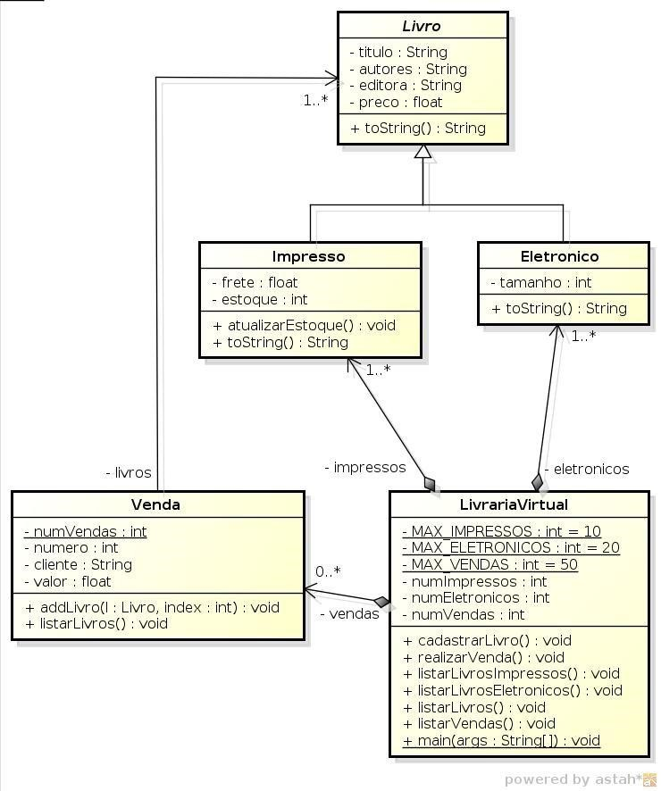

# Sistema de Gerenciamento de Livraria Virtual

Este é um sistema de gerenciamento de livraria que permite o cadastro de livros impressos e eletrônicos, realização de vendas, listagem de livros e vendas, além de registrar o estoque, preço e frete dos livros.

## Funcionalidades Principais

- Cadastro de livros (Impressos e Eletrônicos)
- Realização de vendas de livros
- Listagem de livros disponíveis
- Listagem das vendas realizadas

## Pré-requisitos

- Java 20
- MySQL

## Instalação e Execução

1. Clone este repositório para o seu sistema local:
2. Navegue até o diretório do projeto:
3. Compile e execute o projeto:

## 1. Introdução
Este projeto consiste em implementar um sistema de gerenciamento de uma livraria virtual, explorando os conceitos de composição, herança e polimorfismo. O sistema deve seguir o diagrama de classes UML mostrado abaixo, onde os construtores e os métodos de acesso (getters e setters) foram omitidos:

## 2. Descrição do Sistema
O sistema deverá ser baseado em um menu, com entrada de dados via console, contendo as seguintes opções:

- **Cadastrar livro**: Esta opção permite ao usuário cadastrar um livro.
- **Realizar uma venda**: Esta opção permite ao usuário realizar a venda de um ou mais livros.
- **Listar livros**: O sistema deverá listar todos os livros cadastrados, sejam eles eletrônicos ou impressos.
- **Listar vendas**: O sistema deverá listar todas as vendas realizadas.
- **Sair do programa**: Encerra a execução do programa.

## 3. Descrição das Classes
A seguir, são descritas as classes do sistema.

### 3.1 Livro
A classe abstrata `Livro` possui 4 atributos:

- `titulo`: título do livro;
- `autores`: nome do autor ou dos autores do livro;
- `editora`: nome da editora do livro;
- `preco`: preço do livro.

Os métodos de acesso (getters e setters) e o(s) construtor(es) desta classe e das demais classes foram omitidos e devem ser implementados, mesmo que você não os julgue necessário. O outro método obrigatório da classe `Livro` é descrito a seguir:

- `String toString()`: devolve uma representação textual dos atributos de um livro.

### 3.2 Impresso
A classe `Impresso` representa um livro impresso e possui 2 atributos:

- `frete`: frete cobrado para entrega do livro;
- `estoque`: número de exemplares do livro em estoque.

A seguir, são descritos os métodos da classe `Impresso`:

- `void atualizarEstoque()`: este método deve subtrair 1 do valor do atributo `estoque`;
- `String toString()`: este método devolve uma representação textual de todos os atributos de um livro impresso.

### 3.3 Eletronico
A classe `Eletronico` representa um livro eletrônico e possui 1 atributo:

- `tamanho`: representa o tamanho do arquivo eletrônico do livro em KB.

A seguir, é descrito mais um método obrigatório da classe `Eletronico`:

- `String toString()`: este método devolve uma representação textual de todos os atributos de um livro eletrônico.

### 3.4 Venda
A classe `Venda` possui 5 atributos:

- `livros`: um vetor de referências a objetos do tipo `Livro`, representando os livros associados a uma venda;
- `numVendas`: atributo estático que representa a quantidade de vendas realizadas. Deve ser incrementado de 1 sempre que uma nova venda for realizada;
- `numero`: representa o número da venda, sendo um valor sequencial com início em 1, que é incrementado a cada venda. Utilize o valor do atributo `numVendas` para definir o valor desse atributo;
- `cliente`: nome do cliente que comprou o(s) livro(s);
- `valor`: valor total da venda.

A seguir, são descritos os métodos da classe `Venda`:

- `addLivro(l: Livro, index: int)`: adiciona o livro `l` na posição `index` do array `livros`;
- `listarLivros()`: lista todos os livros da venda.

### 3.5 LivrariaVirtual
A classe `LivrariaVirtual` possui 9 atributos:

- `MAX_IMPRESSOS`: constante que representa o número máximo de livros impressos que podem ser cadastrados;
- `MAX_ELETRONICOS`: constante que representa o número máximo de livros eletrônicos que podem ser cadastrados;
- `MAX_VENDAS`: constante que representa o número máximo de vendas que podem ser cadastradas;
- `impressos`: vetor de referências a objetos da classe `Impresso`, representando os livros impressos cadastrados;
- `eletronicos`: vetor de referências a objetos da classe `Eletronico`, representando os livros eletrônicos cadastrados;
- `vendas`: vetor de referências a objetos da classe `Venda`, representando as vendas realizadas;
- `numImpressos`: número de livros impressos cadastrados;
- `numEletronicos`: número de livros eletrônicos cadastrados;
- `numVendas`: número de vendas realizadas.

A seguir, são descritos os métodos da classe `LivrariaVirtual`:

- `cadastrarLivro()`: Este método é invocado quando a primeira opção do menu do sistema (Cadastrar livro) for selecionada. O usuário deve informar o tipo de livro que será cadastrado: impresso, eletrônico ou ambos. Depois, o sistema deve solicitar os dados do tipo de livro escolhido (ou de ambos). Se não houver mais espaço no vetor para cadastrar um novo livro, o sistema deve exibir uma mensagem.
- `realizarVenda()`: Este método é invocado quando a segunda opção do menu do sistema (Realizar uma venda) é selecionada. O sistema deve solicitar o nome do cliente e a quantidade de livros que ele deseja comprar. Depois, para cada livro, o sistema deve solicitar seu tipo (impresso ou eletrônico), exibir a lista de livros do tipo escolhido e permitir que o usuário escolha um dos livros dessa lista. Utilize os métodos `listarLivrosImpressos()` e `listarLivrosEletronicos()` descritos a seguir.
- `listarLivrosImpressos()`: Exibe no vídeo, no formato de tabela, os dados de todos os livros impressos cadastrados. Utilize o método `toString()` da classe `Impresso`.
- `listarLivrosEletronicos()`: Exibe no vídeo, no formato de tabela, os dados de todos os livros eletrônicos cadastrados. Utilize o método `toString()` da classe `Eletronico`.
- `listarLivros()`: Este método é invocado quando a terceira opção do menu do sistema (Listar livros) é selecionada. O método exibe no vídeo os dados de todos os livros impressos e eletrônicos cadastrados. Utilize os métodos `listarLivrosImpressos()` e `listarLivrosEletronicos()`.
- `listarVendas()`: Este método é invocado quando a quarta opção do menu do sistema (Listar vendas) é selecionada. O método exibe no vídeo os dados de todas as vendas realizadas.
- `main(args: String[])`: Este método deve instanciar um objeto da classe `LivrariaVirtual`, exibir repetidamente o menu de opções e invocar os métodos apropriados a partir da seleção do usuário.

